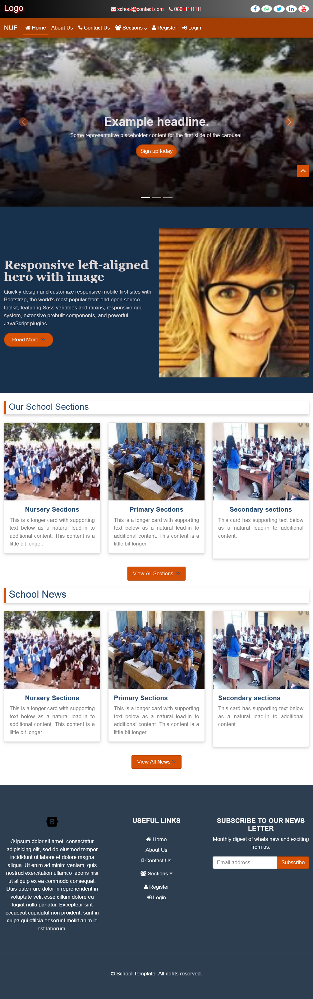

# Basic-School-Template

The Basic School Template is a user-friendly and visually appealing school management system template designed using HTML, CSS, Bootstrap 5.1.3, and jQuery. It includes three main pages: Home Page (index.html), Registration Page (register.html), and Login Page (login.html).

## Features

- Modern and responsive design for easy usability on various devices.
- Intuitive home page introducing the school's mission and highlights.
- User-friendly registration and login pages for seamless interaction.
- Built with Bootstrap 5.1.3 for a consistent and polished UI.
- Enhanced user experience through jQuery interactions.

## Getting Started

To use this template, follow these steps:

1. Clone this repository to your local machine using:

2. Navigate to the project directory:

3. Open the desired page (index.html, register.html, login.html) in your preferred web browser.

## Usage

- **index.html:** The home page provides an overview of the school's key features and mission.
- **register.html:** The registration page allows new users to sign up with their information.
- **login.html:** The login page enables registered users to access the system.

Feel free to modify and extend the template according to your project's requirements.
More features to be added...

## Contributing

Contributions are welcome! If you find any issues or improvements, please create a pull request or raise an issue in this repository.

## License

This project is licensed under the [MIT License](LICENSE).

## Contact

For any inquiries or feedback, please contact [musty009065@gmail.com](mailto:musty009065@gmail.com).

